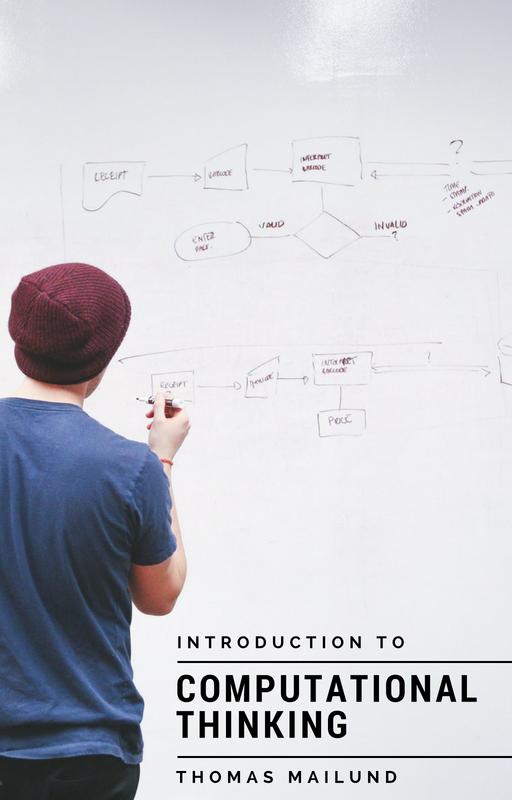

# Introduction to Computational Thinking

These are lecture notes for my class *Computational Thinking in Bioinformatics* but will probably aim to become a book in algorithmic thinking and algorithmic programming independent of the scientific field bioinformatics. Right now, it is just a loose plan for how I might structure the class next year.

